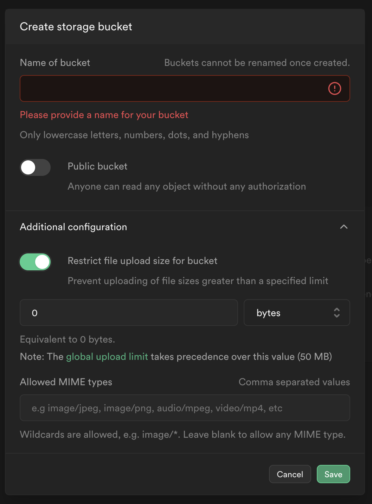

> supabase 是一個開源的後端服務，此篇文章以圖片方式說明，如何快速的使用 supabase 內部的基本功能。

## 建立新專案

- 點擊 `New Project`

  

- 填寫專案名稱，密碼建議使用 `Generate a password`，地區建議選擇 `Tokyo`

  

## Table Editor

> Table Editor 是管理所有 table 的地方，這個分類裡面可以針對個別的表格進行 CRUD，也可以設定該表格的 RLS 規則。

- 建立新表格時，預設會勾選 `Enable Row Level Security`，這個選項建議不要取消勾選。
- 在建立表格階段時，也可以選擇是否將此表格設定為 `Realtime Database`。
- 在 `Columns` 的地方可以增加欄位，並且設定該欄位的預設值、是否為空、是否為主 Key、是否需要關聯

  

### Row Level Security (RLS)

RLS (Row Level Security) 是一種安全措施，讓使用者可以控制哪些人可以存取或修改資料庫中的資料。在 Supabase 中，使用者可以為每個表格設定 RLS 規則，以達到細緻的權限控制。

例如，可以設定一個規則，只允許使用者存取他們自己建立的資料。或者也可以設定一個只有管理員可以修改資料的規則。

#### 模版規則

- Read

  - 此模版允許所有人（無認證使用者）都可以拿到指定 table 的資料。
    

  - 如果希望只有認證過的使用者才可以拿到指定的 table 資料，可以在點擊 `Use this template` 後，將 `Target roles` 的選項改為 `authenticated`。
    

- Insert

  - 此模版允許認證過的使用者才可以寫入資料到指定的 table，但不會限制使用者只能寫入自己建立的資料，也就是說，A 使用者也可以修改 B 使用者的大頭貼。
    

- Update：

  - 此模版只允許前端發過來的 Request Header 中的 JWT token 解析後的 email 跟 sample 表中的 email 相同時，才會被允許更新該筆資料。
    

  - 有可能會發生 table 中不是以 email 作為身分驗證的條件，或者驗證條件不是從 JWT token 中產生，以下有幾個例子可以作為身分驗證的例子：

  1. (auth.role() = 'admin') => 只有在 auth.user 中，`role` 是 `admin` 的人才可以更新該筆資料。

  2. (auth.uid() = table.user_id) => 只有在 auth.user 中，`uid` 與 table 中的 `user_id` 相同時才可以更新該筆資料。

  3. (auth.uid() = table.organization_id AND auth.role() = 'member') => 只有在 auth.user 中，`uid` 與 table 中的 `organization_id` 相同，且 `role` 是 `member` 的人才可以更新該筆資料。

  4. (auth.uid() = table.user_id) AND (table.status = 'active') => 只有在 auth.user 中，`uid` 與 table 中的 `user_id` 相同，且 table 的 `status` 是 `active` 的人才可以更新該筆資料。

  5. (table.is_private = false OR (table.is_private = true AND auth.uid() = table.user_id)) => 如果 table 的 `is_private` 是 `false`，或者 table 的 `is_private` 是 `true` 且 auth.user 中的 `uid` 與 table 中的 `user_id` 相同，則可以更新該筆資料。

- Delete：

  - 此模版只允許 auth.user 中的 uid 與該 table 中的 user_id 相同時，才會被允許刪除該筆資料
    

- Insert：

  - 此模版只允許 auth.user 中的 uid 與該 table 中的 user_id 相同時，才會被允許新增該筆資料
    

## SQL Editor

> SQL Editor 相當於整個 Supabase 的終端機，可以在這邊使用 SQL 語法建立 RLS、Function、Trigger......等。

- 建立 Function 去查找 table 中的所有指定欄位的值
  

- 建立 Function 去呼叫剛剛建立的 Function
  

- 除了，Function 外，也可以建立 Function 後，再建立 Trigger，達到如果 Function 被觸發，就會自動去更新 Table 內的指定欄位的值。

## Database

> Database 頁面主要是跟 Table 表有關的設定，主要會用到的是 Tables、Schema Visualizer、Triggers、Functions。

- Tables：可以看到指定的 Schema 內的所有 Table 資訊。
  

- Schema Visualizer：可以用視圖的方式瞭解各 Table 之間的關聯性。
  

- Triggers：可以在這個頁面以不寫 SQL 的前提下新增 Trigger（但是內部的 Function 還是要寫 SQL）。

- Functions：可以在這頁面內，以 `plpgsql` 方式，快速撰寫 Function。

## Authentication

> 這頁面會顯示所有使用者的身份狀態以及各 Table 的 RLS、可登入的方式......等

- Users：顯示所有使用者的身份狀態。
  

- Policies：顯示指定 Schema 的 所有 Table 的 RLS。
  

- Providers：設定可以提供登入的方式。
  

## Storage

> 此功能可以儲存檔案、圖片，並提供前端快速上傳檔案的 API，此外因為 Storage 也會涉及到 CRUD，所以也要設定相關的 RLS。

- 新增 Bucket：Bucket 是 Storage 中容器的概念，每個 Bucket 之間是不會互相干擾的。
  

  - 如果開啟 `Public bucket` 的話，等於是每個人都可以看到 bucket 中的檔案。

- Additional configuration
  

  - `Restrict file upload size for bucket`：限制上傳的檔案大小。
  - `Allowed MIME types`：限制上傳的副檔名。

- 取得檔案 URL：複製 URL 時，需要選擇該路徑的生效時間。
  

- Storage 相關 APIs：
  - [上傳檔案](https://supabase.com/docs/guides/storage/uploads/standard-uploads)
  - [取得檔案連結](https://supabase.com/docs/guides/storage/serving/downloads)
    - `getPublicUrl` 方法：getPublicUrl 方法用於生成一個指向存儲在 Supabase Storage 中的公開檔案的 URL。使用此方法生成的 URL 不包含任何身份驗證或授權機制，意味著任何人都可以使用這個 URL 存取該檔案。
    - `createSignedUrl` 方法：createSignedUrl 方法用於生成一個有時間限制的簽名 URL。使用此方法生成的 URL 包含一個簽名，這個簽名在特定時間後會過期（你可以指定這個時間），這意味著存取 URL 的時間是有限的。

## API Docs

> 此頁面相當於整個 Supabase 的使用手冊，Tables and Views 的部份會以使用者建立的 Table 去自動生成相對應的 API 寫法，只要按照手冊的寫法就能快速使用 Supabase。

