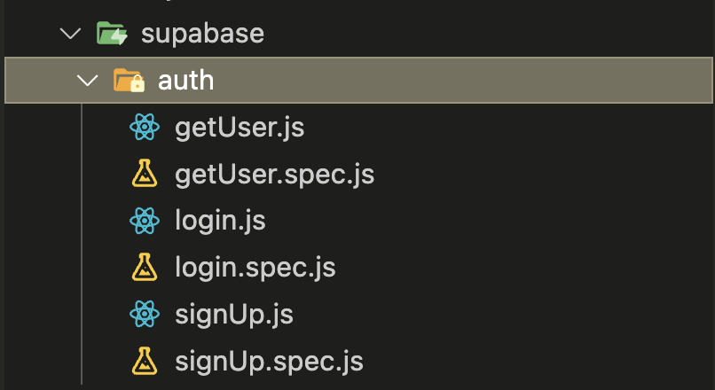
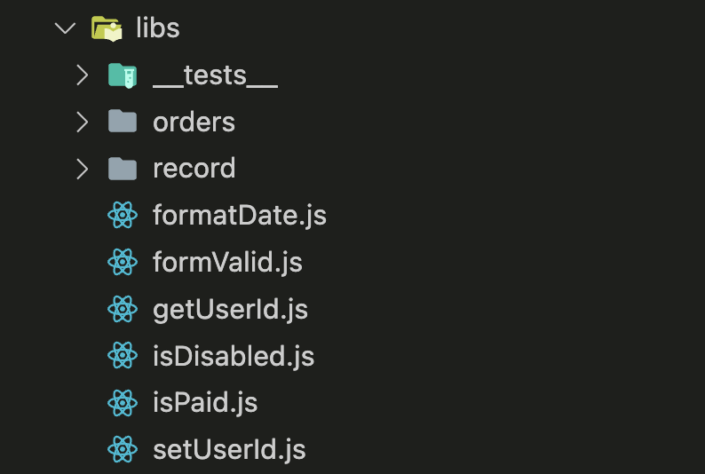

## 專案資料

> 這是一個假設用來記錄自己一天飯錢的小工具，為了測試方便，目前點擊 1 次新增記錄，會直接新增 10 筆資料。

- [GitHub Repo](https://github.com/roceil/-Practice-supabase)
- [記帳小程式](https://supabase.zeabur.app/)

## Folder Structure

```markdown
supabase/
├── src/
│ ├── components/
│ │ ├── ButtonGroup.vue
│ │ ├── FormInput.vue
│ │ ├── FormInput.spec.js
│ │ ├── Header.vue
│ │ └── ...
│ ├── constants/
│ │ └── index.js
│ ├── containers/
│ │ ├── ListForm.vue
│ │ ├── LoginForm.vue
│ │ ├── LoginForm.spec.js
│ │ └── ...
│ ├── libs/
│ │ ├── **tests**/
│ │ │ ├── formatDate.spec.js
│ │ │ ├── formvalid.spec.js
│ │ │ └── isPaid.js
│ │ ├── orders/
│ │ │ ├── currentMonthFilter.js
│ │ │ ├── filterRecordsByMonth.js
│ │ │ └── filterRecordsByStatus.js
│ │ ├── record/
│ │ │ ├── clearOrder.js
│ │ │ ├── countTotal.js
│ │ │ └── createRecordNumber.js
│ │ ├── formateDate.js
│ │ ├── formvalid.js
│ │ ├── isPaid.js
│ │ └── ...
│ ├── router/
│ │ └── index.js
│ ├── styles/
│ │ └── main.css
│ ├── supabase/
│ │ ├── index.js
│ │ ├── auth/
│ │ │ ├── getUser.js
│ │ │ ├── getUser.spec.js
│ │ │ ├── login.js
│ │ │ ├── login.spec.js
│ │ │ ├── signUp.js
│ │ │ └── signUp.spec.js
│ │ ├── orders/
│ │ │ ├── getRecords.js
│ │ │ └── updateRecord.js
│ │ ├── record/
│ │ │ └── addRecord.js
│ │ └── user/
│ │ ├── generateImagePath.js
│ │ ├── generateImagePath.spec.js
│ │ ├── insertUser.js
│ │ ├── insertUser.spec.js
│ │ ├── updateImagePath.js
│ │ ├── updateImagePath.spec.js
│ │ ├── uploadImage.js
│ │ └── uploadImage.spec.js
│ ├── views
│ └── ...
├── .env.example
├── vite.config.js
└── vitest.config.js
```

### 重點結構說明

- `src/`：源碼資料夾，包含所有的 Vue 元件、常數、容器、庫和 Supabase 服務。
  - `components/`：存放最小單位的元件，並且元件內容只處理畫面，一切資料、邏輯都交由 `container` 或 `pinia` 傳遞下來。
  - `constants/`：用於放置常數資料，例如 select 的固定選項、按鈕的固定文字，可以建立一個 `index.js` 統一管理。
  - `containers/`：用於存放邏輯並且有容器概念的元件。
  - `libs/`：用於存放處理資料的工具程式碼。
  - `supabase/`：正常會放在 `services` 資料夾內，但因為專案只用到一個外部服務，所以直接使用服務名稱，並將相關的程式碼集中在此資料夾內。
  - `router/`：存放路由設定。
  - `styles/`：存放 CSS 樣式檔。
  - `views/`：存放 Vue 視圖元件。
- `.env.example`：環境變數範例檔案。
- `vite.config.js`：Vite 的設定檔案。
- `vitest.config.js`：Vitest 的設定檔案。
- 單元測試程式碼：與受測物放在一起，但如果受測物數量不多，則在受測物的父層資料夾建立 `_tests_` 進行統一管理。
  - 與受測物放一起
    
  - 在受測物的父層建立資料夾管理
    

## 架構說明

- 使用 Tailwind 進行樣式管理。
- 使用 Vue3 搭配 Composition API 進行開發。
- 使用 Vue Router 作為路由管理工具。
- 使用 Vitest 進行單元測試。
- 使用 Supabase 作為後端資料庫。
- 使用 Supabase 作為使用者驗證工具。
- 使用 Supabase 作為圖片儲存空間。

## 問題記錄

### vue

- `v-model` 作為 Props 傳遞並使用 Emits 觸發更新的寫法：
  在 Vue3 中，我們可以使用 `v-model` 將資料作為 props 傳遞給子元件，並且當子元件需要更新這個資料時，可以發出一個帶有新值的 `update:modelValue` 事件。以下是一個範例：

- 父層元件

```vue
<script setup>
import { ref } from 'vue'
import customInput from '@/components/customInput'

const value = ref(0)
</script>

<template>
	<customInput v-model="value" />
</template>
```

- 子元件（customInput）

```vue
<script setup>
import { ref } from 'vue'

defineProps(['modelValue'])

const emit = defineEmits(['update:modelValue'])

const updateValue = (newValue) => {
	emit('update:modelValue', newValue)
}
</script>

<template>
	<input :value="modelValue" @input="updateValue($event.target.value)" />
</template>
```

- 在父元件中，customInput 被與 `value` 進行雙向綁定，然後，這個值作為 `props` 傳遞給子元件 `customInput`。
- 在子元件中，先定義可接受的 `Props` 與要進行 `Emits` 的事件
- 接著宣告 `update` 的函式，並帶入到 input 的 `@input` 內，表示 input 的值如果有更動，就會馬上觸發 `update` 函式，並且告訴父層元件更動後的值。
- 最後將 `modelValue` 寫到 input 的 value 內，完成子元件的資料綁定。

### supabase

- 所有跟 supabase 有關的功能函式，全部都獨立於 `@/supabase` 內部。
- 建立 table 時，還需要建立 `RLS` 規則，因為預設會開啟空白的 RLS，如果沒有任何規則，會導致無法做 CRUD。
- `createSignedUrl`：整個函式為 `supabase.storage.from(<table-name>).createSignedUrl(name,minSec)`，其中 minSec 代表的是該檔案路徑的有效時間，目前沒有無限時長，所以可以先設定為 1年（毫秒）。
- 如果想做 `auth.user` 跟 `public.user` 的同步，可以在 supabase 的 signUp 結束之後，再打一次 public.user 的 insert，這樣可以不用再寫 SQL function 跟 trigger。

### vitest

- 樣式元件測試：樣式元件的測試重點為，該元件中的函式有沒有被觸發

  1. 先使用 `wrapper` 將要使用的元件模擬出來，如果該元件需要傳入 Props 則需要在第二個參數內帶入。
  2. wrapper 會抓到的是整個元件的 HTML 結構，所以如果要關注某特定元素，則使用 `find` 去尋找。
  3. 可視情況決定找到的元素需不需要用變數儲存。
  4. 最後可以使用 `wrapper.emitted()` 來檢查整個測試過程，元件有沒有產生任何 emit 事件。

  ```js
  import { describe, it, expect } from 'vitest'
  import { mount } from '@vue/test-utils'
  import FormInput from '@/components/FormInput.vue'

  describe('FormInput', () => {
  	it('當沒有輸入時，不觸發 update:modelValue 事件', async () => {
  		const wrapper = mount(FormInput, {
  			props: {
  				modelValue: '',
  				itemName: '帳號'
  			}
  		})

  		// 找到輸入框並填入測試資料
  		wrapper.find('input')

  		// 檢查是否觸發了 update:modelValue 事件
  		expect(wrapper.emitted()['update:modelValue']).toBeFalsy()
  		expect(wrapper.emitted()['update:modelValue']).toBeUndefined()
  	})

  	it('當輸入改變時，應該觸發 update:modelValue 事件', async () => {
  		const wrapper = mount(FormInput, {
  			props: {
  				modelValue: '',
  				itemName: '帳號'
  			}
  		})

  		// 找到輸入框並填入測試資料
  		const input = wrapper.find('input')
  		await input.setValue('new value')

  		// 檢查是否觸發了 update:modelValue 事件
  		expect(wrapper.emitted()['update:modelValue']).toBeTruthy()
  		expect(wrapper.emitted()['update:modelValue'][0]).toEqual(['new value'])
  	})
  })
  ```

- 邏輯元件測試：建議可以將測試的邏輯程式碼，盡量寫成 pure function 的形式，也就是函式內部只處理一件事，並且內部不引入任何函式，所有參數都是透過呼叫 pure function 的地方傳入。

  1. 引入受測物。
  2. 在個別測試項目中，先準備測試變數，（Arrange）
  3. 實際使用測試變數去執行受測物，（Act）
  4. 斷言測試結果有無符合預期，（Assert）

  - 受測物

    ```js
    const isPaid = (status) => {
    	return status ? '已付款' : '未付款'
    }

    export default isPaid
    ```

  - 測試程式碼

    ```js
    import { describe, it, expect } from 'vitest'
    import isPaid from '@/libs/isPaid'

    describe('isPaid', () => {
    	it('回應『已付款』', () => {
    		const status = true
    		const result = isPaid(status)
    		expect(result).toBe('已付款')
    	})

    	it('回應『未付款』', () => {
    		const status = false
    		const result = isPaid(status)
    		expect(result).toBe('未付款')
    	})
    })
    ```

- 外部服務測試：專案架構中使用到 supabase，但為避免實際去呼叫 supabase 的 API，所以單元測試會 mock 整個 supabase，當原本有使用到 supabase api 的函式被呼叫時，函式會去呼叫 mock 掉的 supabase 模組。

1. 先引入受測物函式。
2. 為避免實際呼叫到 supabase 所以 mock 掉整個 supabase。
3. 因為受測物內部有使用到瀏覽器的 `alert`，這個在測試環境（jsdom）中是無法實現的，所以這個功能要在跑整個測試前先進行 mock，等測試結束後再回覆成原本狀態，（Arrange）
4. 在個別測試中，準備測試變數，（Arrange）
5. 實際呼叫 supabase 登入函式，（Act）
6. 斷言測試結果有無符合預期，（Assertion）

- 補充說明：

  - `jsdom` 是一種在 Node.js 環境中模擬瀏覽器的工具，提供了一個偽造的瀏覽器環境，讓我們可以執行和測試 JavaScript 代碼。然而，由於 `jsdom` 只是模擬瀏覽器，並不能完全模擬所有的瀏覽器 API，例如 `alert` 或 `localStorage` 等。因此，我們可以選擇將這些 API "模擬"（mock）起來，讓我們可以在測試中使用它們。當測試結束後，我們再將這些模擬的 API 恢復到原本的狀態。這樣，我們就可以在測試中模擬和驗證這些 API 的行為，而無需真正的瀏覽器環境。

- supabase 登入

  ```js
  import supabase from '@/supabase'

  const getUser = async (userId) => {
  	const { data, error } = await supabase.from('users').select().eq('id', userId)

  	if (error) {
  		alert(error.message)
  		return
  	}

  	return data
  }

  export default getUser
  ```

- 測試程式碼

  ```js
  import { describe, it, expect, vi, beforeAll, afterAll } from 'vitest'
  import getUser from '@/supabase/auth/getUser'

  // 模擬 supabase 以涵蓋成功和失敗的案例
  vi.mock('@/supabase', () => {
  	return {
  		default: {
  			from: () => ({
  				select: () => ({
  					eq: (columnName, userId) => {
  						if (userId === 1) {
  							// 成功案例
  							return Promise.resolve({ data: [{ [columnName]: userId }], error: null })
  						} else {
  							// 失敗案例
  							return Promise.resolve({ data: null, error: { message: 'User not found' } })
  						}
  					}
  				})
  			})
  		}
  	}
  })

  describe('getUser', () => {
  	let originalAlert

  	// 在所有測試之前，模擬 window.alert
  	beforeAll(() => {
  		originalAlert = window.alert // 保存原始的 alert 函數
  		window.alert = vi.fn() // 使用模擬的 alert
  	})

  	// 測試完畢後清除模擬
  	afterAll(() => {
  		window.alert = originalAlert // 恢復原始的 alert 函數
  	})
  	it('取得使用者資料', async () => {
  		const userId = 1
  		const result = await getUser(userId)
  		expect(result).toEqual([{ id: userId }])
  	})

  	it('取得使用者資料失敗', async () => {
  		const userId = 2
  		await getUser(userId)
  		expect(window.alert).toHaveBeenCalledWith('User not found')
  	})
  })
  ```
